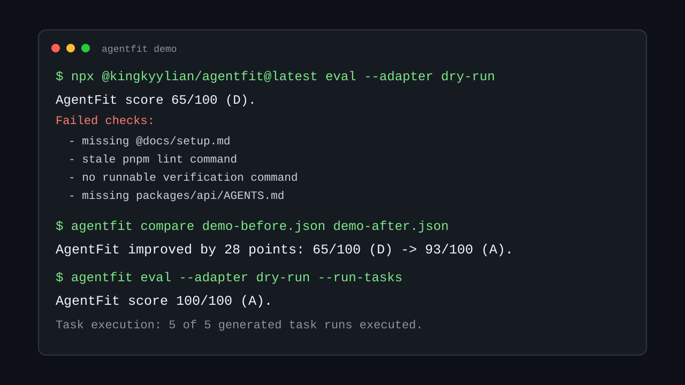

# AgentFit

Test whether your `AGENTS.md` and coding-agent instructions actually work.

Agent instruction files rot. Setup commands change, docs move, nested packages get missed, and teams guess whether a prompt change helped. AgentFit turns that guess into a local-first score, report, and CI check.

AgentFit discovers `AGENTS.md`, `CLAUDE.md`, Cursor rules, Copilot instructions, and other agent harness files. It checks whether instructions are discoverable, commands still work, references resolve, nested packages are covered, and generated repo-specific tasks can be verified in isolated git worktrees.




```bash
npx @kingkyylian/agentfit@latest eval --adapter dry-run
```

```text
AgentFit score: 93/100 (A)
AgentFit score 93/100 (A).
Instruction files: 1
Reference issues: 0
Tasks: 5
Task execution: static dry-run preview; generated tasks were not executed.
Runs: 0 executed, 5 previewed
```

Execute generated tasks in isolated worktrees when you want command-level proof:

```bash
npx @kingkyylian/agentfit@latest eval --adapter dry-run --run-tasks
```

AgentFit's own repository currently scores `100/100 (A)` with `5 of 5` generated task runs executed.

## What It Catches

- missing referenced docs such as `@docs/setup.md`
- stale commands such as `pnpm lint` after the script was removed
- missing verification commands before agents claim work is done
- monorepo packages with no nested `AGENTS.md`
- instruction changes that look better but lower the score

## 60-Second Demo

The included demo starts with a stale `AGENTS.md`, then compares it with a fixed version:

```bash
npx @kingkyylian/agentfit@latest compare examples/reports/demo-before.json examples/reports/demo-after.json --format markdown
```

```text
AgentFit improved by 28 points: 65/100 (D) -> 93/100 (A).
Fixed checks:
- No nested instruction file found for packages/api.
- Documented command references missing package script "lint".
- No runnable verification command found in instruction files.
- 1 instruction reference is missing or invalid.
```

See [docs/demo.md](docs/demo.md).

## What You Get

- deterministic instruction discovery
- command and reference checks
- generated repo-specific fitness tasks
- JSON and Markdown reports
- before/after report comparison
- SVG badge output
- GitHub Action support for PRs
- optional real-agent adapters, starting with Codex

## Why Now

Agent-aware repositories are becoming normal. The missing piece is regression testing: once `AGENTS.md`, `CLAUDE.md`, or Cursor rules are part of the development workflow, they need the same feedback loop as code. AgentFit gives maintainers a quick answer before and after an instruction change.

## Real-World Validation

On 2026-05-11, AgentFit ran 20 dry-run snapshots against public repositories that already publish coding-agent instructions. Dry-run mode did not call model providers or execute generated tasks.

The clearest finding was in RedisInsight: Cursor rules documented stale root E2E scripts. The maintainers requested a PR and merged the fix:

- Issue: https://github.com/redis/RedisInsight/issues/5887
- PR: https://github.com/redis/RedisInsight/pull/5889

The same validation pass also found AgentFit false positives, including package-local command checks that now resolve nested package scripts in `0.1.10`. No endorsement is implied by any repository being tested.

Suggest a public repository for dry-run validation: https://github.com/kingkyylian/agentfit/issues/9

## AgentFit Compared

| Tool Type | Checks Syntax | Runs Repo Tasks | Measures Agent Results | Local-First |
| --- | --- | --- | --- | --- |
| Heuristic linters | Yes | No | No | Usually |
| Observability tools | No | Sometimes | Yes | Usually no |
| AgentFit | Yes | Yes | Yes | Yes |

## Scoring

Scores are out of 100:

- 20 instruction discoverability
- 15 command freshness
- 15 reference integrity
- 20 evaluation pass rate
- 10 diff discipline
- 10 safety guardrails
- 10 reproducibility

See [docs/scoring.md](docs/scoring.md).

By default, dry-run mode performs deterministic discovery, reference, command, and task-generation checks. Use `--run-tasks` or a real adapter when you want generated tasks executed in isolated worktrees.

## GitHub Action

```yaml
- uses: kingkyylian/agentfit@v1
  with:
    version: 0.1.10
    adapter: dry-run
    run-tasks: true
    fail-below-score: 70
    task-count: 5
    timeout-seconds: 900
    budget-usd: 1
    format: markdown
```

See [docs/github-action.md](docs/github-action.md).

AgentFit uses this Action on its own repository with `run-tasks: true` and a minimum score of `90`.

For a complete workflow that updates a pull request comment with the AgentFit report, see [docs/pr-comment-workflow.md](docs/pr-comment-workflow.md).

## Real-World Examples

Dry-run snapshots from public repositories:

| Repository | Score | Signal |
| --- | ---: | --- |
| `hexlet-codebattle/codebattle` | 80/100 (B) | stale documented scripts and a nested scope gap |
| `Brendonovich/MacroGraph` | 73/100 (C) | broad monorepo scope coverage gaps |
| `skybrush-io/skybrush-server` | 93/100 (A) | healthy single instruction file |

See [docs/real-world.md](docs/real-world.md).

## Good First Issues

- [Add more real-world dry-run snapshots](https://github.com/kingkyylian/agentfit/issues/1)
- [Add a nested monorepo instruction fixture](https://github.com/kingkyylian/agentfit/issues/2)
- [Add Codex adapter smoke tests](https://github.com/kingkyylian/agentfit/issues/4)
- [Improve safety and reproducibility signal detection](https://github.com/kingkyylian/agentfit/issues/5)
- [Add an animated terminal GIF or asciicast](https://github.com/kingkyylian/agentfit/issues/6)

## License

MIT

## Contributing

Keep changes local-first, deterministic by default, and transparent in reports. Real-agent adapters should be optional and must report skipped runs clearly when unavailable.

See [CONTRIBUTING.md](CONTRIBUTING.md).
